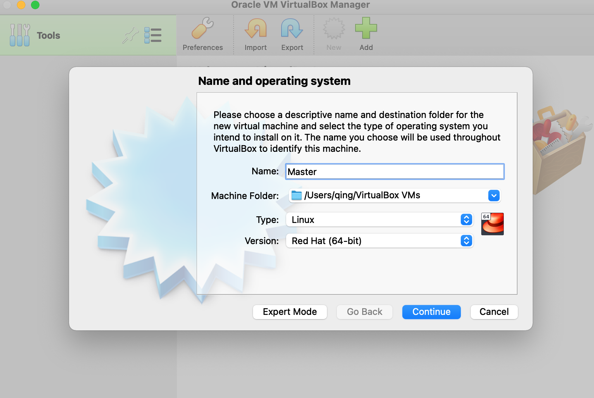
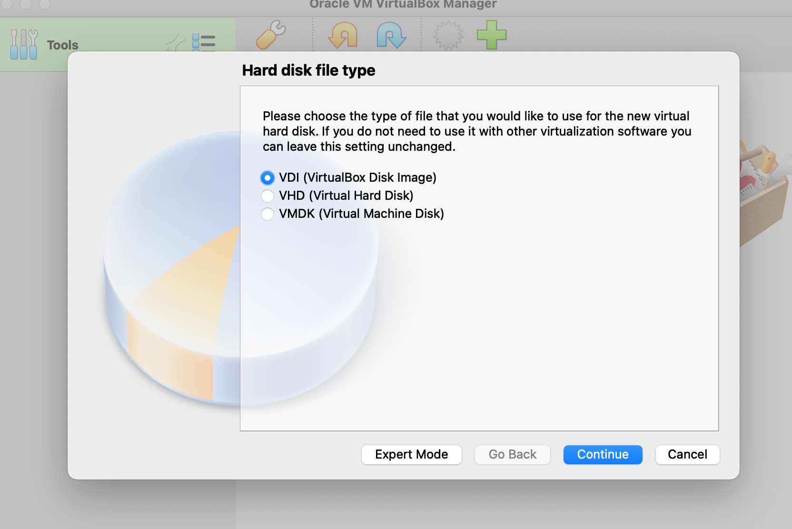
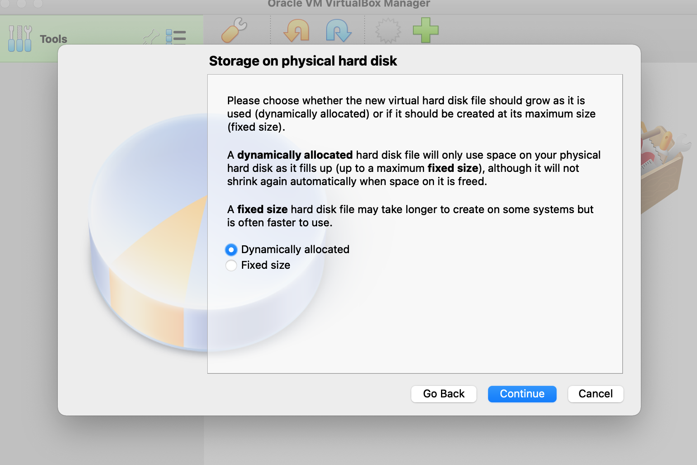
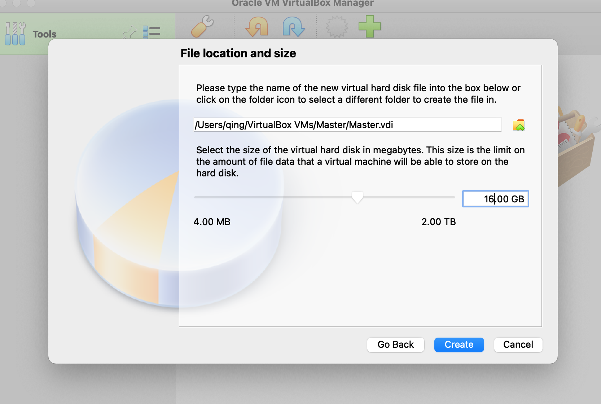
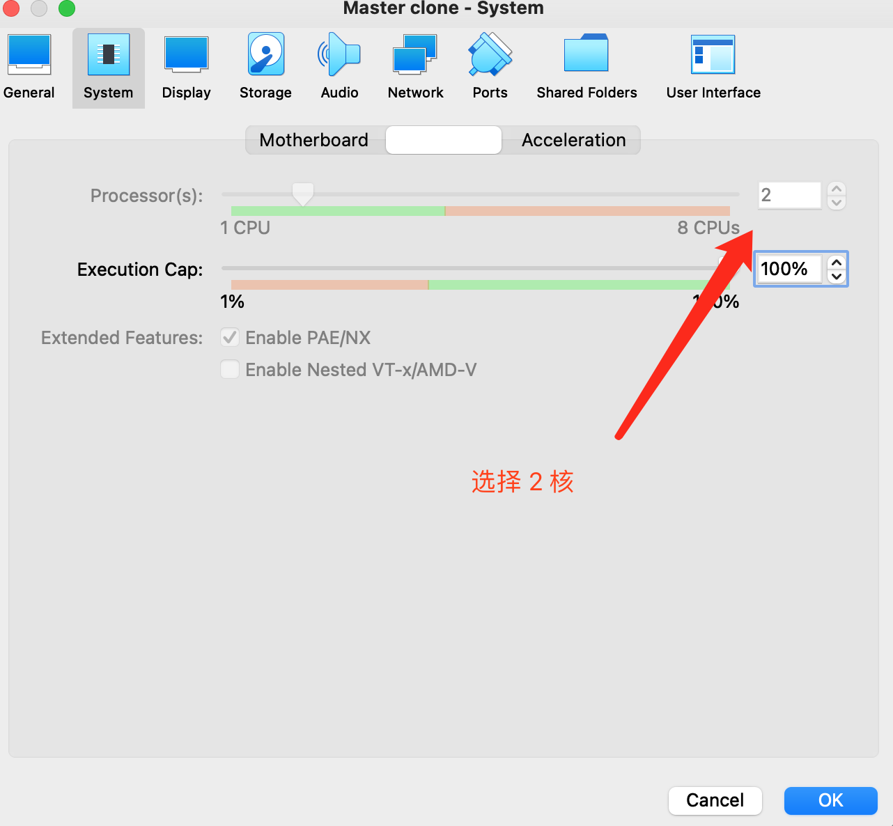
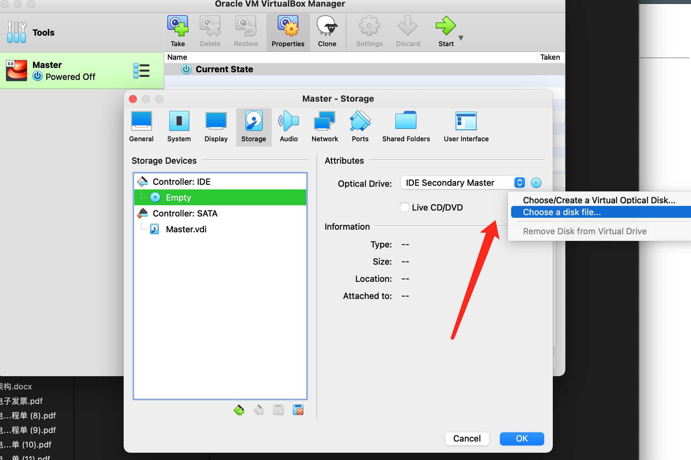
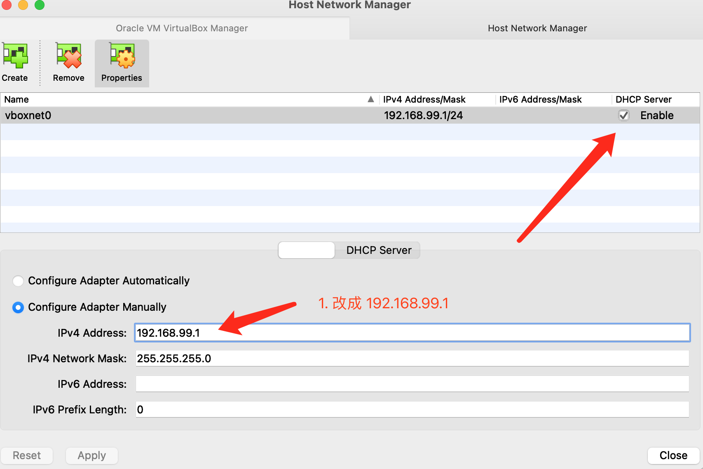
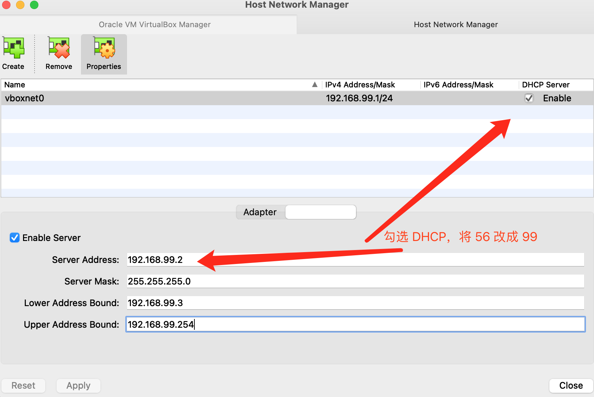
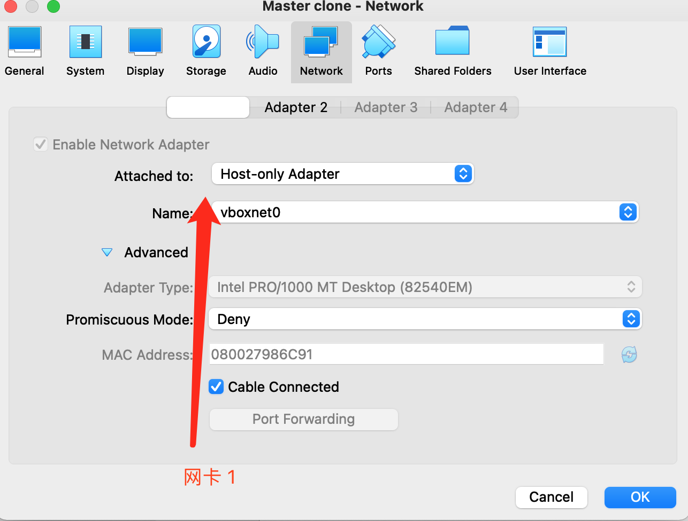
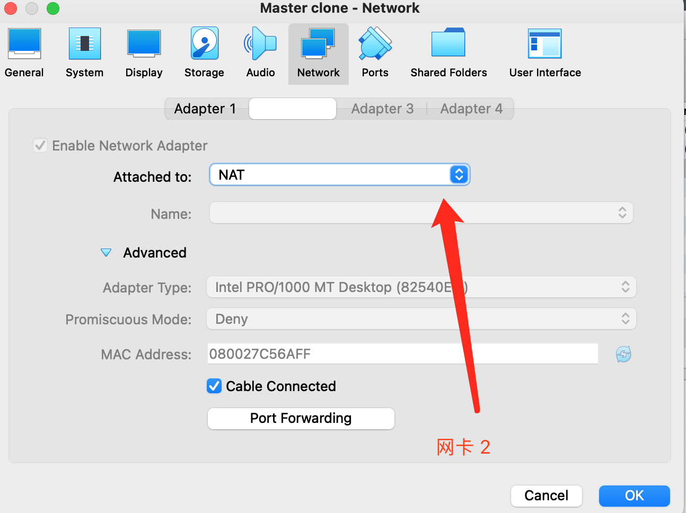

# Virtualbox 安装Centos7
===
可以在前一行的末尾加入至少两个空格  








centos7下载  
阿里云: http://mirrors.aliyun.com/centos/7/isos/x86_64/CentOS-7-x86_64-DVD-2009.iso  
个人网盘: 链接：https://pan.baidu.com/s/1vhl3rqHPTqTNq_FcPqtKgQ?pwd=r3es
提取码：r3es

选择下载的.iso 文件作为系统盘，启动虚拟机  


# 配置虚机双网卡,实现固定 IP，且能访问外网  
1. 查看虚拟机网络，点击‘文件’—>‘主机网络管理器’，选择“手动配置网卡”，修改ip地址为（192.168.99.1）。  
    
    
2. 为虚拟机配置网卡  
  网卡 1： 选择host-only网卡（注意第一个网卡选择 host-only）  
        
  网卡 2： 选择NAT  
    
3. 重启虚拟机  
  此时在虚拟机 ping www.baidu.com 是返回成功的
4. 设置外部网络访问虚拟机  
  设置静态ip地址，编辑网络配置文件，编辑网络设置文件  
    ```shell
    vi /etc/sysconfig/network-scripts/ifcfg-enp0s3
    ```
    ```shell
    ONBOOT=yes
    BOOTPROTO=static
    IPADDR=192.168.99.101
    ```  
    其中，ONBOOT=Yes 表示开机启动，BOOTPROTO=static为静态 IP 生效，IP 地址为192.168.99.101。修改完如下所示：

    ```shell
    TYPE=Ethernet
    PROXY_METHOD=none
    BROWSER_ONLY=no
    #BOOTPROTO=dhcp
    DEFROUTE=yes
    IPV4_FAILURE_FATAL=no
    IPV6INIT=yes
    IPV6_AUTOCONF=yes
    IPV6_DEFROUTE=yes
    IPV6_FAILURE_FATAL=no
    IPV6_ADDR_GEN_MODE=stable-privacy
    NAME=enp0s3
    UUID=08012b4a-d6b1-41d9-a34d-e0f52a123e7a
    DEVICE=enp0s3
    ONBOOT=yes
    BOOTPROTO=static
    IPADDR=192.168.99.101
    ```
5. 重启网络  
    ```shell
    systemctl restart network
    ```
6. 查看 enp0s3 网卡的 ip  
    ```shell
    [root@localhost Final]#ip addr |grep 192
    inet 192.168.99.101/24 brd 192.168.99.255 scope global noprefixroute enp0s3
    ```
7. 此时虚拟机既可以访问外网，也能够和宿主机( 192.168.31.178)进行通信
    ```shell
    ping 192.168.31.178
    PING 192.168.31.178 (192.168.31.178): 56 data bytes
    64 bytes from 192.168.31.178: icmp_seq=0 ttl=64 time=0.060 ms
    ```
8. 使用iTerm2 免密登录虚拟机Master
    ```shell
    ssh-copy-id root@192.168.99.101
    ssh 'root@192.168.99.101'
    ```
9. 配置 Master 和 work 节点的域名  
    vim /etc/hosts
    ```shell
     192.168.99.101 master
     192.168.99.102 node1
     192.168.99.103 node2
    ```
